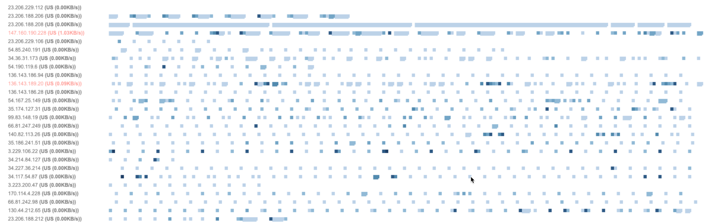

# TrafficMonitor
This project presents an experimental view of network data, offering a fresh perspective beyond traditional line or bar graphs. Unlike conventional network monitoring tools that often lack historical context, this visualization provides a color-coded timeline of network activity, independent of each source.


## 🛠️ Installation & Usage  

### Prerequisites  
- Node.js (v16+ recommended)  
- npm or yarn  

### Setup  
1. Clone the repository:  
   ```bash
   git clone https://github.com/Farsheed/TrafficMonitor
   cd TrafficGraph
   ```
2. Install dependencies:  
   ```bash
   npm install
   ```
3. Start the application:  
   ```bash
   sudo npm start
   ```
   If you want to show the local IP addresses as well set the environment variable `SHOW_LOCAL_IP` to `true`:
   ```bash
   sudo SHOW_LOCAL_IP=true npm start
   ```
4. Open your browser at:  
   ```bash
   http://localhost:3000
   ```

Below is a full-day visualization of network traffic from a laptop running this tool:

